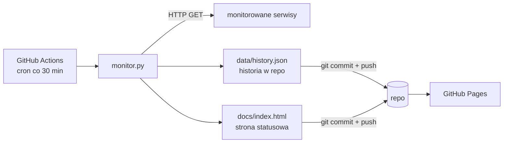

# 📡 status-watch

Bezserwerowy monitor dostępności stron i API — działa w całości na **GitHub Actions**
(cron co 30 minut), a wyniki publikuje jako statyczną stronę statusową na
**GitHub Pages**. Zero infrastruktury, zero kosztów, pełna historia w gicie.

**Strona statusowa:** https://mcjkrok.github.io/status-watch

## Jak to działa



1. Workflow `monitor` odpala się co 30 minut (albo ręcznie z zakładki Actions).
2. `monitor.py` czyta listę serwisów z `checks.yaml` i robi HTTP GET do każdego.
3. Wyniki (status, czas odpowiedzi) dopisuje do `data/history.json` — historia
   sprawdzeń jest wersjonowana w gicie, więc niczego nie trzeba hostować.
4. Z historii liczy uptime za 24 h i 7 dni i generuje `docs/index.html`.
5. Workflow commituje zmiany z powrotem do repo; GitHub Pages serwuje stronę.
6. Gdy któryś serwis nie odpowiada, run w Actions robi się **czerwony** —
   GitHub sam wysyła wtedy powiadomienie e-mail o nieudanym workflow.

## Dodanie serwisu do monitorowania

Jeden wpis w `checks.yaml`:

```yaml
services:
  - name: Moje API
    url: https://api.example.com/healthz
```

## Uruchomienie lokalne

```bash
git clone https://github.com/mcjkrok/status-watch.git
cd status-watch
python -m venv .venv && source .venv/bin/activate
pip install -r requirements-dev.txt
pytest -v          # testy (httpx.MockTransport — bez prawdziwych requestów)
python monitor.py  # jednorazowe sprawdzenie + wygenerowanie docs/index.html
```

## Struktura

```
status-watch/
├── monitor.py                  # cała logika: checki, historia, render strony
├── checks.yaml                 # konfiguracja monitorowanych serwisów
├── data/history.json           # historia sprawdzeń (commitowana przez bota)
├── docs/index.html             # wygenerowana strona statusowa (GitHub Pages)
├── tests/test_monitor.py       # testy pytest
└── .github/workflows/
    ├── monitor.yml             # cron co 30 min: check → commit → Pages
    └── ci.yml                  # lint (ruff) + testy przy każdym pushu/PR
```

## Decyzje techniczne

- **GitHub Actions jako "serwer"** — cron w Actions zastępuje osobną maszynę;
  to samo podejście co w popularnym projekcie Upptime.
- **Historia w gicie zamiast bazy danych** — dla checków co 30 min JSON w repo
  w zupełności wystarcza, a za darmo dostajemy backup i pełny audyt zmian.
- **`concurrency` w workflow** — dwa runy naraz zrobiłyby konflikt przy pushu,
  więc kolejne czekają w kolejce.
- **`[skip ci]` w commitach bota** — commit z danymi nie powinien odpalać CI.
- **Exit code 1 przy awarii** — czerwony run w Actions to darmowy alerting
  (e-mail od GitHuba), bez konfigurowania czegokolwiek.
- **Testy bez sieci** — `httpx.MockTransport` symuluje odpowiedzi 200/503
  i błędy połączenia, więc testy są szybkie i deterministyczne.

## Stack

Python 3.12 · httpx · PyYAML · pytest · ruff · GitHub Actions (cron) · GitHub Pages
