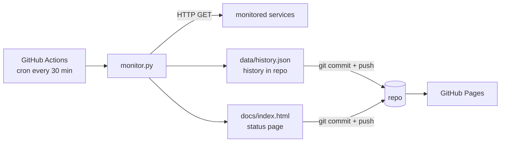

# 📡 status-watch

Serverless uptime monitor for websites and APIs — runs entirely on **GitHub Actions**
(cron every 30 minutes) and publishes the results as a static status page on
**GitHub Pages**. No infrastructure, no cost, full history kept in git.

**Live status page:** https://mcjkrok.github.io/status-watch

## How it works


```mermaid
flowchart LR
    CRON[GitHub Actions<br/>cron every 30 min] --> M[monitor.py]
    M -->|HTTP GET| S1[monitored services]
    M --> H[data/history.json<br/>history in repo]
    M --> P[docs/index.html<br/>status page]
    H & P -->|git commit + push| REPO[(repo)]
    REPO --> PAGES[GitHub Pages]
```

1. The `monitor` workflow fires every 30 minutes (or manually from the Actions tab).
2. `monitor.py` reads the service list from `checks.yaml` and sends an HTTP GET to each.
3. Results (status, response time) are appended to `data/history.json` — the check
   history is versioned in git, so nothing needs to be hosted anywhere.
4. From that history it computes 24 h and 7 d uptime and renders `docs/index.html`.
5. The workflow commits the changes back to the repo; GitHub Pages serves the page.
6. When a service is down the Actions run turns **red** — GitHub then sends a
   failed-workflow email on its own.

## Adding a service to monitor

One entry in `checks.yaml`:

```yaml
services:
  - name: My API
    url: https://api.example.com/healthz
```

## Running locally

```bash
git clone https://github.com/mcjkrok/status-watch.git
cd status-watch
python -m venv .venv && source .venv/bin/activate
pip install -r requirements-dev.txt
pytest -v          # tests (httpx.MockTransport — no real requests)
python monitor.py  # single check + regenerate docs/index.html
```

## Layout

```
status-watch/
├── monitor.py                  # all logic: checks, history, page rendering
├── checks.yaml                 # monitored services configuration
├── data/history.json           # check history (committed by the bot)
├── docs/index.html             # generated status page (GitHub Pages)
├── tests/test_monitor.py       # pytest suite
└── .github/workflows/
    ├── monitor.yml             # cron every 30 min: check → commit → Pages
    └── ci.yml                  # lint (ruff) + tests on every push/PR
```

## Design decisions

- **GitHub Actions as the "server"** — an Actions cron replaces a dedicated machine;
  the same approach the popular Upptime project takes.
- **History in git instead of a database** — for checks every 30 minutes a JSON file
  in the repo is plenty, and it gives backups and a full audit trail for free.
- **`concurrency` in the workflow** — two simultaneous runs would collide on push,
  so later ones queue up.
- **`[skip ci]` in bot commits** — a data commit should not trigger CI.
- **Exit code 1 on failure** — a red Actions run is free alerting (email from
  GitHub) with nothing to configure.
- **Network-free tests** — `httpx.MockTransport` simulates 200/503 responses and
  connection errors, keeping the suite fast and deterministic.

## Stack

Python 3.12 · httpx · PyYAML · pytest · ruff · GitHub Actions (cron) · GitHub Pages
